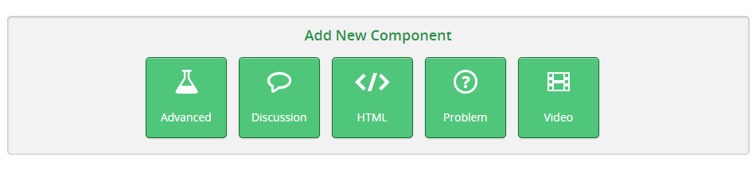
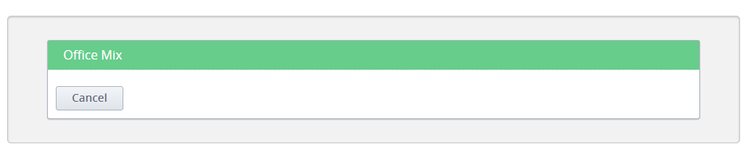
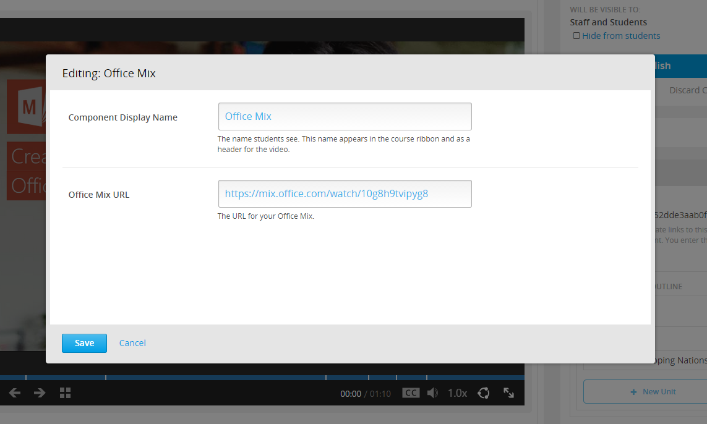
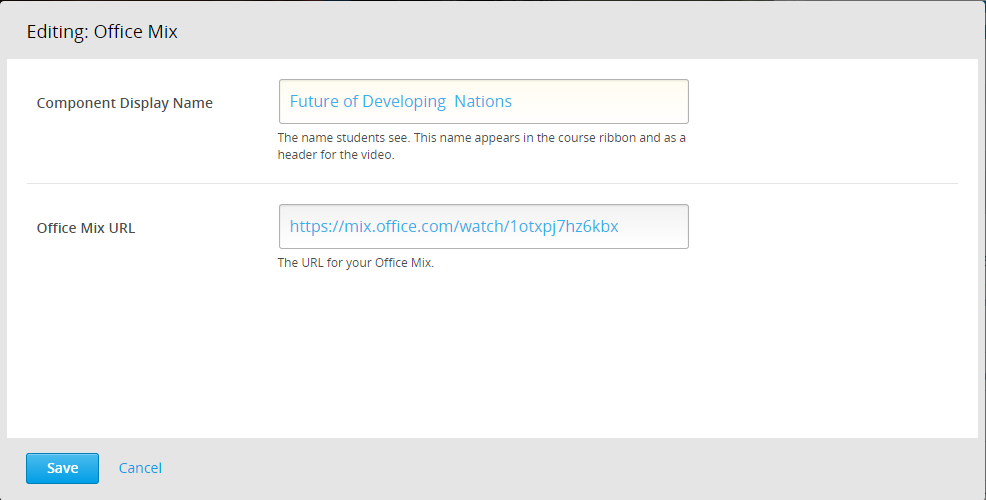
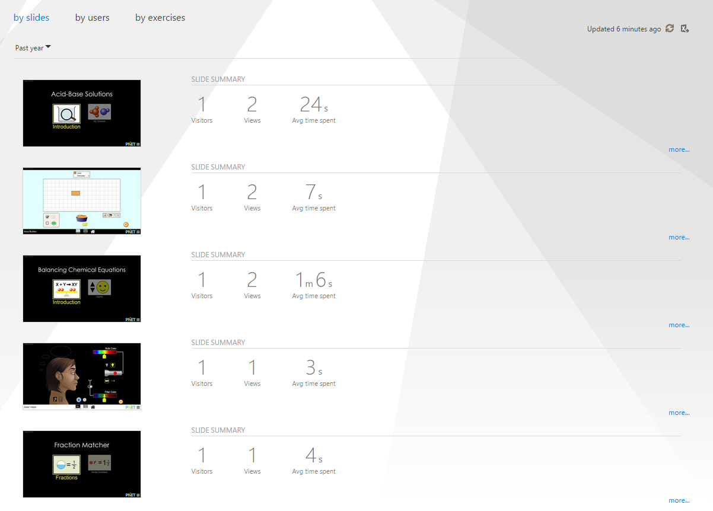

Office Mix XBlock
=================
This XBlock allows for the embedding of lectures hosted on [Office Mix](https://mix.office.com) directly into an edX course. Students can then view the mixes natively on edX.org.

See it in action by watching this [Office Mix XBlock introduction mix](https://mix.office.com/watch/1vxsk29nweg3x).

Installation
------------
To install the Office Mix XBlock within your edX python environment simply run.

```bash
$ pip install -r requirements.txt
```

Enabling in Studio
------------------

After installed to enable the Office Mix XBlock within studio navigate to `Settings -> Advanced Settings` from the top nav bar. Then add `"officemix"` to the Advanced Module List, as shown in the screen shot below.


Usage
-----
Once enabled in studio, making use of the Office Mix XBlock is an easy process.

Start by navigating to the unit in studio where you want to insert your Office Mix. From here choose the `Advanced` component. 



This will bring up a list of the XBlocks that have been enabled in studio. If you followed the previous step to enable the Office Mix XBlock in studio you will see an `Office Mix` option. Click on it to insert the Office Mix XBlock into your unit.



After you've inserted the Office Mix XBlock a default Office Mix will be inserted into your unit as shown in the screen shot below.


To change the inserted XBlock click on the `Edit` button in the upper right corner of the Office Mix XBlock. This will bring up the edit dialog where you can change the display name of the component as well as the Office Mix that is being inserted.



Update the component name to the text you want displayed and then insert the link to the Office Mix you want to embed in your unit.



After you click save your Office Mix XBlock will have been updated with the new values.


At this point simply click on the Publish button and the Office Mix will be available to students to view from within the LMS.


And as with any Office Mix, all of your analytics are available at the Office Mix website.  



License
-------
The Office Mix XBlock is released under the MIT license.

Contact Us
----------
For any questions about the Office Mix XBlock or help with using it, feel free to email us at support@officemix.uservoice.com.
